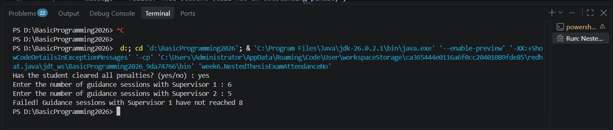
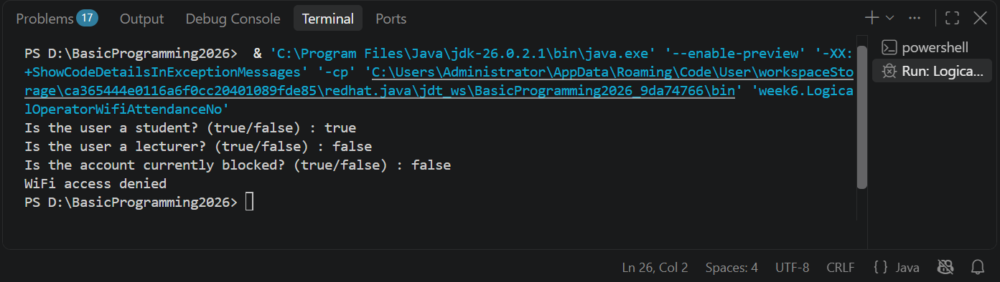
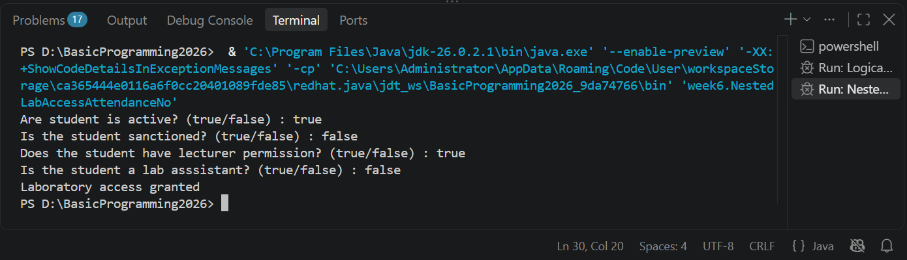
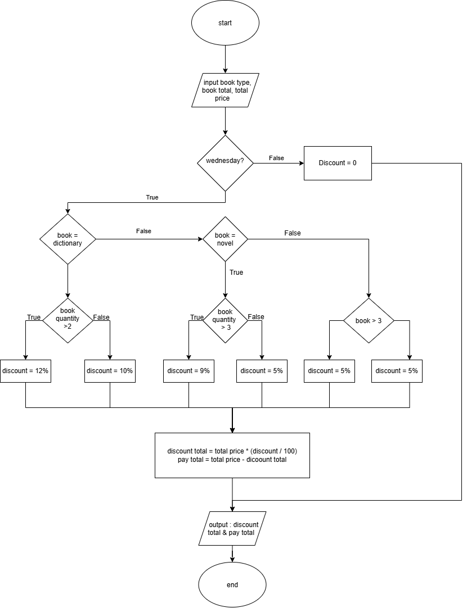
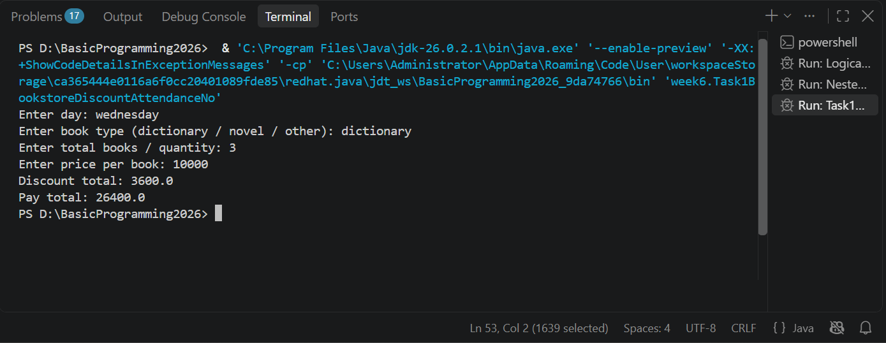

# JOBSHEET 6 - SELECTION STATEMENTS 2

**Student Identity:**

- **Name:** **[Muhamad Dzaky Ammar Naufal]**
- **Student ID (NIM):** **[264107020222]**
- **Class / Attendance No.:** **[1I/21]**


---

## 1: PRACTICUM OBJECTIVES

The objectives of this practicum are as follows:

- Students can solve problems and case studies using nested selection statements.
- Students can apply nested selection statements in Java programs.
- Students can apply the logical operators `&&`, `||`, and `!` in selection structures.

---

## 2: EXPERIMENT RESULTS & ANALYSIS

### 2.1 Experiment 1: Nested IF to Check Thesis Exam Requirements

A student wants to register for the thesis exam. The system first checks an administrative requirement: the student must have no outstanding penalties. If this is met, the system checks the guidance log: at least 8 sessions with Supervisor 1 and at least 4 sessions with Supervisor 2. If all requirements are met, the student may register. Otherwise, the system shows the reason for failure.

#### 2.1.1 Java Program Code

File: [`code/NestedThesisExamAttendanceNo.java`](code/NestedThesisExamAttendanceNo.java)

```java
import java.util.Scanner;

public class NestedThesisExamAttendanceNo {
    public static void main(String[] args) {
        Scanner sc = new Scanner(System.in);
        String message;

        System.out.print("Has the student cleared all penalties? (Yes/No): ");
        String noPenalty = sc.nextLine().trim();

        System.out.print("Enter the number of guidance sessions with Supervisor 1: ");
        int guidanceCount1 = sc.nextInt();

        System.out.print("Enter the number of guidance sessions with Supervisor 2: ");
        int guidanceCount2 = sc.nextInt();

        // Level 1: administrative requirement (penalty)
        if (noPenalty.equalsIgnoreCase("Yes")) {
            // Level 2: guidance log requirement
            if (guidanceCount1 >= 8 && guidanceCount2 >= 4) {
                message = "All requirements met. The student may register for the thesis exam";
            } else if (guidanceCount1 < 8 && guidanceCount2 < 4) {
                message = "Failed! Guidance sessions with Supervisor 1 are below 8 and Supervisor 2 are below 4";
            } else if (guidanceCount1 < 8) {
                message = "Failed! Guidance sessions with Supervisor 1 have not reached 8";
            } else {
                message = "Failed! Guidance sessions with Supervisor 2 have not reached 4";
            }
        } else {
            message = "Failed! The student still has an outstanding penalty";
        }
        System.out.println(message);

        sc.close();
    }
}
```

📌 **TARUH FOTO SCREENSHOT KODE DI SINI** — nama file: `images/exp1-code.png`



#### 2.1.2 Output Screenshot

Expected output for the input `yes`, `6`, `5`:

```
Has the student cleared all penalties? (Yes/No): yes
Enter the number of guidance sessions with Supervisor 1: 6
Enter the number of guidance sessions with Supervisor 2: 5
Failed! Guidance sessions with Supervisor 1 have not reached 8
```

📌 **TARUH FOTO SCREENSHOT OUTPUT DI SINI** — nama file: `images/exp1-output.png`


#### 2.1.3 Test Table

| **No** | **Input (Penalty cleared, Sup. 1, Sup. 2)** | **Output** | **Status** |
| --- | --- | --- | --- |
| 1 | yes, 6, 5 | Failed! Guidance sessions with Supervisor 1 have not reached 8 | Invalid |
| 2 | Yes, 8, 4 | All requirements met. The student may register for the thesis exam | Valid |
| 3 | Yes, 5, 2 | Failed! Guidance sessions with Supervisor 1 are below 8 and Supervisor 2 are below 4 | Invalid |
| 4 | Yes, 8, 2 | Failed! Guidance sessions with Supervisor 2 have not reached 4 | Invalid |
| 5 | No, 8, 4 | Failed! The student still has an outstanding penalty | Invalid |

#### 2.1.4 Answers to Questions

**Question 1:** What happens if the student answers "No" to the penalty-clearance question? Why?

**Answer:** The condition `noPenalty.equalsIgnoreCase("Yes")` becomes false, so the program skips the whole inner block and goes to the outer `else`. It prints "Failed! The student still has an outstanding penalty". This happens because the penalty is the first requirement. If it is not met, the guidance sessions are not checked at all, even if the numbers are high enough.

**Question 2:** Explain the meaning of the following code snippet!

```java
if (guidanceCount1 >= 8 && guidanceCount2 >= 4) {
```

**Answer:** The condition is true only when the student has at least 8 sessions with Supervisor 1 **and** at least 4 sessions with Supervisor 2. The `&&` (AND) operator needs both comparisons to be true. If one of them is false, the whole condition is false and the program moves to the next `else if`.

**Question 3:** Describe the full flow of checking the student's requirements from start to finish. Explain step by step for every condition!

**Answer:**

1. The program reads the penalty status (`noPenalty`) and the two guidance counts (`guidanceCount1` and `guidanceCount2`).
2. **Level 1:** It checks `noPenalty.equalsIgnoreCase("Yes")`. If false, the message is "the student still has an outstanding penalty" and the program jumps to the output.
3. If true, the program goes to **Level 2** and checks `guidanceCount1 >= 8 && guidanceCount2 >= 4`. If true, the message is "All requirements met. The student may register for the thesis exam".
4. If that is false, it checks `guidanceCount1 < 8 && guidanceCount2 < 4`. If true, both supervisors' requirements are not met.
5. If that is also false, it checks `guidanceCount1 < 8`. If true, only the Supervisor 1 requirement is not met.
6. Otherwise (the last `else`), only the Supervisor 2 requirement is not met.
7. Finally, `System.out.println(message)` prints the chosen message.

---

### 2.2 Experiment 2: Logical Operators to Determine Campus WiFi Access

The campus WiFi can only be used by students or lecturers whose accounts are not blocked. This experiment practices the logical operators `&&` (AND), `||` (OR), and `!` (NOT).

#### 2.2.1 Java Program Code

File: [`code/LogicalOperatorWifiAttendanceNo.java`](code/LogicalOperatorWifiAttendanceNo.java)

```java
import java.util.Scanner;

public class LogicalOperatorWifiAttendanceNo {
    public static void main(String[] args) {
        Scanner sc = new Scanner(System.in);

        boolean isStudent;
        boolean isLecturer;
        boolean isBlocked;

        System.out.print("Is the user a student? (true/false): ");
        isStudent = sc.nextBoolean();

        System.out.print("Is the user a lecturer? (true/false): ");
        isLecturer = sc.nextBoolean();

        System.out.print("Is the account currently blocked? (true/false): ");
        isBlocked = sc.nextBoolean();

        if ((isStudent || isLecturer) && !isBlocked) {
            System.out.println("WiFi access granted");
        } else {
            System.out.println("WiFi access denied");
        }

        sc.close();
    }
}
```

📌 **TARUH FOTO SCREENSHOT KODE DI SINI** — nama file: `images/exp2-code.png`


#### 2.2.2 Output Screenshot

📌 **TARUH FOTO SCREENSHOT OUTPUT DI SINI (4 test, boleh digabung dalam 1 gambar)** — nama file: `images/exp2-output.png`



#### 2.2.3 Test Table

| **Test** | **isStudent** | **isLecturer** | **isBlocked** | **Output** |
| --- | --- | --- | --- | --- |
| 1 | true | false | false | WiFi access granted |
| 2 | false | true | false | WiFi access granted |
| 3 | true | false | true | WiFi access denied |
| 4 | false | false | false | WiFi access denied |

#### 2.2.4 Answers to Questions

**Question 1:** Explain the function of the `||`, `&&`, and `!` operators in the condition above.

**Answer:** `||` (OR) is true if at least one side is true, so the user can be a student or a lecturer. `!` (NOT) reverses a boolean value, so `!isBlocked` is true when the account is **not** blocked. `&&` (AND) is true only if both sides are true, so the user must have a valid role **and** the account must not be blocked.

**Question 2:** Why can a lecturer still get access when `isStudent = false`?

**Answer:** Because `isStudent || isLecturer` uses OR. If `isLecturer` is true, the OR result is true even when `isStudent` is false. If the account is also not blocked, the whole condition is true, so access is granted.

**Question 3:** Change `||` to `&&`. Run the program again using test data 1 and 2. What happens, and why?

**Answer:** The condition becomes `(isStudent && isLecturer) && !isBlocked`.

- Test 1 (true, false, false): `true && false` is false, so the output is "WiFi access denied".
- Test 2 (false, true, false): `false && true` is false, so the output is also "WiFi access denied".

Both users are now denied because `&&` needs the user to be a student **and** a lecturer at the same time, and most users are only one of them.

**Question 4:** In the expression `isStudent || isLecturer`, when does `isLecturer` not need to be evaluated? Explain using short-circuit evaluation.

**Answer:** When `isStudent` is true. An OR expression is already true if the first side is true, so Java does not check the second side. This is called short-circuit evaluation.

**Question 5:** In the expression `(isStudent || isLecturer) && !isBlocked`, when does `!isBlocked` not need to be evaluated? Explain.

**Answer:** When `(isStudent || isLecturer)` is false, which means the user is neither a student nor a lecturer (Test 4). An AND expression is already false if the first side is false, so Java skips `!isBlocked`. The result is "WiFi access denied" no matter what the blocked status is.

---

### 2.3 Experiment 3: Nested IF and Logical Operators to Determine Laboratory Access

A student may use the laboratory outside class hours if their status is active and they are not currently under sanction. If this is met, the system does a second check. Laboratory access is granted if the student has lecturer permission or is a lab assistant.

#### 2.3.1 Java Program Code

File: [`code/NestedLabAccessAttendanceNo.java`](code/NestedLabAccessAttendanceNo.java)

```java
import java.util.Scanner;

public class NestedLabAccessAttendanceNo {
    public static void main(String[] args) {
        Scanner sc = new Scanner(System.in);

        boolean isActiveStudent;
        boolean isSanctioned;
        boolean hasLecturerPermit;
        boolean isLabAssistant;

        System.out.print("Is active student? (true/false): ");
        isActiveStudent = sc.nextBoolean();

        System.out.print("Is sanctioned? (true/false): ");
        isSanctioned = sc.nextBoolean();

        System.out.print("Has lecturer permit? (true/false): ");
        hasLecturerPermit = sc.nextBoolean();

        System.out.print("Is lab assistant? (true/false): ");
        isLabAssistant = sc.nextBoolean();

        // Level 1: student status
        if (isActiveStudent && !isSanctioned) {
            // Level 2: permission
            if (hasLecturerPermit || isLabAssistant) {
                System.out.println("Laboratory access granted");
            } else {
                System.out.println("Access denied: lecturer permission or lab assistant status required");
            }
        } else {
            System.out.println("Access denied: student status does not meet the requirement");
        }

        sc.close();
    }
}
```

📌 **TARUH FOTO SCREENSHOT KODE DI SINI** — nama file: `images/exp3-code.png`


#### 2.3.2 Output Screenshot

📌 **TARUH FOTO SCREENSHOT OUTPUT DI SINI (3 output berbeda, boleh digabung)** — nama file: `images/exp3-output.png`



#### 2.3.3 Input Combinations and Outputs

| **No** | **isActiveStudent** | **isSanctioned** | **hasLecturerPermit** | **isLabAssistant** | **Output** |
| --- | --- | --- | --- | --- | --- |
| 1 | true | false | true | false | Laboratory access granted |
| 2 | true | false | false | true | Laboratory access granted |
| 3 | true | false | false | false | Access denied: lecturer permission or lab assistant status required |
| 4 | true | true | true | true | Access denied: student status does not meet the requirement |
| 5 | false | false | true | true | Access denied: student status does not meet the requirement |

All three possible outputs appear at least once.

#### 2.3.4 Answers to Questions

**Question 1:** Why is the check `hasLecturerPermit || isLabAssistant` placed inside the first IF?

**Answer:** The permission check only matters for students who already meet the basic requirement (active and not sanctioned). A student who fails the first requirement must be denied, no matter what permission they have. Putting the second check inside the first IF keeps this order and also lets each stage show its own denial message.

**Question 2:** Explain the function of the `&&`, `||`, and `!` operators in this program.

**Answer:** `&&` in `isActiveStudent && !isSanctioned` means the student must be active and not sanctioned at the same time. `!` reverses `isSanctioned`, so the condition is true when the student is **not** sanctioned. `||` in `hasLecturerPermit || isLabAssistant` needs only one of the two (permission or lab assistant) to be true.

**Question 3:** Can the access requirement be written as a single condition `isActiveStudent && !isSanctioned && (hasLecturerPermit || isLabAssistant)`? Explain whether the final access decision stays the same.

**Answer:** Yes. The final decision (granted or denied) stays the same, because access is granted only when all three parts are true. The difference is that a single condition cannot tell which requirement failed. The program would only have one `else` and can only print one general denial message.

**Question 4:** What is the advantage of using Nested IF in this case, compared to a single IF, if the system needs to show different reasons for denial?

**Answer:** Nested IF separates the checks into stages, so each `else` knows exactly which stage failed. The program can then show a specific reason (problem with student status, or missing permission). With a single IF, the user only knows that access was denied, but not why.

**Question 5:** Create one input combination that causes access to be denied at the first level, and one that causes it to be denied at the second level.

**Answer:**

- Denied at the first level: `isActiveStudent = true`, `isSanctioned = true`, `hasLecturerPermit = true`, `isLabAssistant = true`. Output: "Access denied: student status does not meet the requirement".
- Denied at the second level: `isActiveStudent = true`, `isSanctioned = false`, `hasLecturerPermit = false`, `isLabAssistant = false`. Output: "Access denied: lecturer permission or lab assistant status required".

---

## 3: INDEPENDENT ASSIGNMENTS

- **Task 1:** Implement the bookstore discount flowchart (Exercise 2 of Week 6) using nested IF.
- **Task 2:** Create a lab-assistant candidate selection program using nested IF and logical operators.

### 3.1 Task 1: Bookstore Discount System

#### 3.1.1 Flowchart

The program is based on the flowchart created in Exercise 2 of Week 6.

📌 **TARUH FOTO FLOWCHART TOKO BUKU DI SINI** — nama file: `images/task1-flowchart.png`



**Discount rules (applied only on Wednesday):**

| **Book Type** | **Condition** | **Discount** |
| --- | --- | --- |
| Dictionary | qty > 2 | 12% |
| Dictionary | qty ≤ 2 | 10% |
| Novel | qty > 3 | 5% |
| Novel | qty ≤ 3 | 0% |
| Other books | qty > 3 | 9% |
| Other books | qty ≤ 3 | 8% |
| Any book | Not Wednesday | 0% |

> ⚠️ **CEK:** Aturan diskon di atas saya ambil dari template. Samakan dengan flowchart kamu. Kalau beda, kirim ke saya dan kode + tabel akan disesuaikan. Hapus catatan ini setelah dicek.

#### 3.1.2 Java Program Code

File: [`code/Task1BookstoreDiscountAttendanceNo.java`](code/Task1BookstoreDiscountAttendanceNo.java)

```java
import java.util.Scanner;

public class Task1BookstoreDiscountAttendanceNo {
    public static void main(String[] args) {
        Scanner sc = new Scanner(System.in);

        System.out.print("Enter day: ");
        String day = sc.nextLine().trim();

        System.out.print("Enter book type (dictionary / novel / other): ");
        String type = sc.nextLine().trim();

        System.out.print("Enter quantity: ");
        int qty = sc.nextInt();

        System.out.print("Enter price per book: ");
        double price = sc.nextDouble();

        double totalPrice = qty * price;
        double discount = 0;

        // Level 1: discount only applies on Wednesday
        if (day.equalsIgnoreCase("Wednesday")) {
            // Level 2: book type
            if (type.equalsIgnoreCase("dictionary")) {
                // Level 3: quantity
                if (qty > 2) {
                    discount = 12;
                } else {
                    discount = 10;
                }
            } else if (type.equalsIgnoreCase("novel")) {
                if (qty > 3) {
                    discount = 5;
                } else {
                    discount = 0;
                }
            } else { // other books
                if (qty > 3) {
                    discount = 9;
                } else {
                    discount = 8;
                }
            }
        } else {
            discount = 0;
        }

        double discountAmount = totalPrice * (discount / 100);
        double totalPay = totalPrice - discountAmount;

        System.out.println("-----------------------------");
        System.out.println("Total price    : " + totalPrice);
        System.out.println("Discount (" + discount + "%): " + discountAmount);
        System.out.println("Total to pay   : " + totalPay);

        sc.close();
    }
}
```

📌 **TARUH FOTO SCREENSHOT KODE DI SINI** — nama file: `images/task1-code.png`


#### 3.1.3 Output Screenshot

📌 **TARUH FOTO SCREENSHOT OUTPUT DI SINI** — nama file: `images/task1-output.png`



#### 3.1.4 Test Table (price per book = 50,000)

| **No** | **Day** | **Type** | **Qty** | **Discount** | **Discount Amount** | **Total to Pay** |
| --- | --- | --- | --- | --- | --- | --- |
| 1 | Wednesday | dictionary | 3 | 12% | 18,000 | 132,000 |
| 2 | Wednesday | dictionary | 2 | 10% | 10,000 | 90,000 |
| 3 | Wednesday | novel | 4 | 5% | 10,000 | 190,000 |
| 4 | Wednesday | novel | 3 | 0% | 0 | 150,000 |
| 5 | Wednesday | other | 4 | 9% | 18,000 | 182,000 |
| 6 | Wednesday | other | 2 | 8% | 8,000 | 92,000 |
| 7 | Monday | dictionary | 3 | 0% | 0 | 150,000 |

#### 3.1.5 Analysis

The program has three levels of nesting. The first level checks the day, the second checks the book type, and the third checks the quantity. Each path ends by giving one discount value, so the discount calculation and the output are written only once at the end, just like the merge point in the flowchart. The "other books" case is handled by the last `else`, because it covers every type that is not a dictionary and not a novel.

---

### 3.2 Task 2: Lab-Assistant Candidate Selection System

#### 3.2.1 Selection Rules

- **Stage 1:** The student must be active **and** not under academic sanction.
- **Stage 2:** The student must have a Basic Programming grade of at least 80 **or** a programming competency certificate.
- **Stage 3:** The student is called for an interview and is accepted if the interview score is at least 75.
- The program shows the reason whenever a student fails at any stage.

#### 3.2.2 Java Program Code

File: [`code/Task2AssistantSelectionAttendanceNo.java`](code/Task2AssistantSelectionAttendanceNo.java)

```java
import java.util.Scanner;

public class Task2AssistantSelectionAttendanceNo {
    public static void main(String[] args) {
        Scanner sc = new Scanner(System.in);

        System.out.print("Is the student active? (yes/no): ");
        boolean active = sc.nextLine().trim().equalsIgnoreCase("yes");

        System.out.print("Is the student under academic sanction? (yes/no): ");
        boolean sanction = sc.nextLine().trim().equalsIgnoreCase("yes");

        System.out.print("Basic Programming grade: ");
        double grade = sc.nextDouble();
        sc.nextLine(); // clear the buffer after nextDouble()

        System.out.print("Has programming competency certificate? (yes/no): ");
        boolean certificate = sc.nextLine().trim().equalsIgnoreCase("yes");

        // Stage 1: status
        if (active && !sanction) {
            // Stage 2: competency
            if (grade >= 80 || certificate) {
                System.out.println("Stage 1 & 2 passed. Student is called for an interview.");
                System.out.print("Enter interview score: ");
                double interview = sc.nextDouble();

                // Stage 3: interview
                if (interview >= 75) {
                    System.out.println("RESULT: ACCEPTED as lab assistant.");
                } else {
                    System.out.println("RESULT: NOT ACCEPTED. Reason: interview score is below 75.");
                }
            } else {
                System.out.println("RESULT: NOT ACCEPTED. Reason: Basic Programming grade is below 80 "
                        + "and the student has no programming competency certificate.");
            }
        } else {
            if (!active && sanction) {
                System.out.println("RESULT: NOT ACCEPTED. Reason: student is not active and is under academic sanction.");
            } else if (!active) {
                System.out.println("RESULT: NOT ACCEPTED. Reason: student is not active.");
            } else {
                System.out.println("RESULT: NOT ACCEPTED. Reason: student is under academic sanction.");
            }
        }

        sc.close();
    }
}
```

📌 **TARUH FOTO SCREENSHOT KODE DI SINI** — nama file: `images/task2-code.png`


#### 3.2.3 Output Screenshot

📌 **TARUH FOTO SCREENSHOT OUTPUT DI SINI** — nama file: `images/task2-output.png`


#### 3.2.4 Test Table

| **No** | **Active** | **Sanction** | **Grade** | **Certificate** | **Interview** | **Result** |
| --- | --- | --- | --- | --- | --- | --- |
| 1 | yes | no | 85 | no | 80 | ACCEPTED as lab assistant |
| 2 | yes | no | 70 | yes | 75 | ACCEPTED as lab assistant |
| 3 | yes | no | 85 | no | 60 | NOT ACCEPTED: interview score is below 75 |
| 4 | yes | no | 70 | no | - | NOT ACCEPTED: grade below 80 and no certificate |
| 5 | no | no | 90 | yes | - | NOT ACCEPTED: student is not active |
| 6 | yes | yes | 90 | yes | - | NOT ACCEPTED: student is under academic sanction |
| 7 | no | yes | 90 | yes | - | NOT ACCEPTED: not active and under academic sanction |

#### 3.2.5 Analysis

The selection has three stages, and each stage is an `if` nested inside the previous one. A student reaches the next stage only after passing the previous one. Stage 1 uses `&&` with `!` (`active && !sanction`) and Stage 2 uses `||` (`grade >= 80 || certificate`). The interview score is only asked for students who pass Stages 1 and 2. Every `else` prints a specific reason, so the user knows exactly why a candidate failed.

---

## 4: CONCLUSION

Nested selection lets a program check conditions in stages: an inner condition is checked only when the outer condition is met. This is useful for multi-step processes such as thesis exam requirements, laboratory access, discount calculation, and candidate selection, and it makes it possible to show a specific reason for each failure. The logical operators `&&`, `||`, and `!` combine several conditions into one expression, and short-circuit evaluation skips the second operand when the first one already decides the result. In this practicum, problems and flowcharts were translated directly into nested `if` statements. Some things to watch out for are the order of conditions, the use of parentheses for operator precedence, and Scanner input handling, such as clearing the buffer with `nextLine()` after `nextDouble()`.
